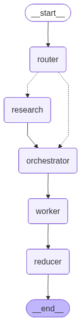
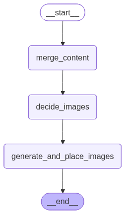

# AI Blog Agent
This system is an autonomous multi-agent workflow built using LangGraph, Tavily and Streamlit. It automates the technical content creation lifecycle, including web research, architectural planning, markdown generation, and AI-driven image insertion.

## System Architecture

The application manages the writing process through a directed acyclic graph state machine:

* **Router**: Analyzes the topic to decide between closed_book, hybrid, or open_book research modes.
* **Researcher**: Uses Tavily Search to gather high-signal evidence and documentation when research is required.
* **Orchestrator**: Acts as a principal engineer to design a 5–9 section outline with specific goals and technical requirements.
* **Worker**: Writes individual sections in Markdown, adhering to the plan and citing evidence.
* **Reducer**: Merges content and manages a subgraph for visual assets and image placement.

<table align="center">
  <tr>
    <td align="center">
      
      <br>
      <b>LangGraph Workflow</b>
    </td>
    <td align="center">
      
      <br>
      <b>Reducer Subgraph</b>
    </td>
  </tr>
</table>


## Key Features

* **Implementation-Oriented**: Focuses on concrete APIs, data structures, and engineering terminology rather than vague phrasing.
* **Structured Output**: Uses Pydantic models to ensure the LLM follows strict formatting for plans and Markdown.
* **Automated Citations**: In open_book mode, the agent supports claims using URLs found during the research phase.
* **Visual Integration**: Automatically decides where a diagram would assist the reader and generates custom image prompts.
* **Streamlit Frontend**: Provides a UI to track agent progress, preview Markdown, and download a complete bundle of text and images.

## Prerequisites

* Python 3.10 or higher.
* API Keys for the following services:
    * Groq
    * Tavily Search
    * Gemini (Image generation)

## Installation and Setup

1.  **Install Dependencies**:
    ```bash
    pip install langgraph langchain_core langchain_groq langchain_community pydantic streamlit google-genai python-dotenv
    ```

2.  **Configure Environment**:
    Create a `.env` file in the root directory with the following variables:
    ```env
    GROQ_API_KEY=your_groq_key
    TAVILY_API_KEY=your_tavily_key
    GEMINI_API_KEY=your_gemini_key
    ```

3.  **Run the Application**:
    ```bash
    streamlit run frontend.py
    ```

## File Overview

* `backend.py`: Contains the LangGraph definition, node functions (Router, Orchestrator, Worker), and image generation logic.
* `frontend.py`: The Streamlit UI that handles state streaming, Markdown rendering, and past blog management.
* `images/`: A directory created automatically to store generated visual assets.